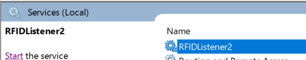

## Execution steps
If you want to run this project directly then follow below steps otherwise import it in Netbeans or other java IDE
	
	Open command prompt and run camel_socket/run_server_first.bat
	Open another command prompt and run camel_socket/run_client_second.bat
Output

Directory Structure

## Install as service
	open cmd and goto release folder
	change path according to your computer
	E:\camel-socket\release>InstallAsWindowsService.bat
	
Service Screenshot

	
	
## Common Errors

### java.net.ConnectException: Connection refused: connect
	solution start the server first
### io.netty.handler.codec.TooLongFrameException: Adjusted frame length exceeds 1048576: 1214606448 - discarded

change **allowDefaultCodec=false**  in URI

	from("netty:tcp://localhost:4209?allowDefaultCodec=false&sync=false")

[Reference Sites](http://www.masterspringboot.com/various/camel/using-camel-netty-components-to-manage-socket-routes)

	
